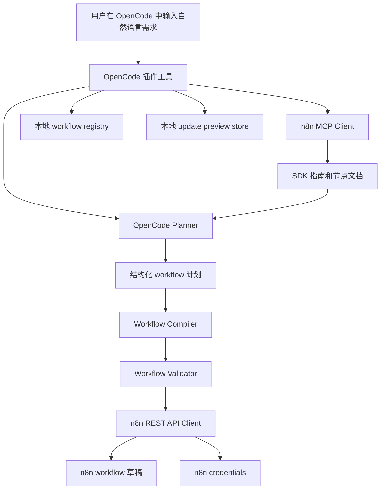

# opencode-n8n-builder

`opencode-n8n-builder` 是一个用于连接 OpenCode 和 n8n 的插件。它允许用户用自然语言描述自动化需求，由 OpenCode 结合 n8n 官方 MCP 节点文档生成、检查并安全更新 n8n workflow 草稿。

当前版本：`0.1.0`

当前状态：早期 `v0.1` 版本。核心的“托管 workflow”生命周期已经实现并通过测试，安全策略较保守，适合继续迭代验证。

## 项目目标

这个项目的目标是让用户可以在 OpenCode 中用自然语言描述自动化流程，例如：

- “当收到 webhook 后，把订单信息整理后发送到 Slack。”
- “每天早上拉取某个接口的数据，过滤异常记录，然后发邮件提醒。”
- “给已有的托管 workflow 增加一个错误通知步骤。”

插件会负责：

1. 读取 n8n 官方 MCP 提供的 SDK 指南和节点文档。
2. 让 OpenCode 生成结构化 workflow 计划。
3. 将计划编译成 n8n workflow JSON。
4. 校验 workflow 的安全性和结构合法性。
5. 通过 n8n REST API 创建或更新 workflow。
6. 在本地 registry 中记录哪些 workflow 是由本插件托管的。

第一版重点不是“接管所有 n8n workflow”，而是建立一个安全、可控、可多轮对话迭代的托管 workflow 工作流。

## 为什么要这样设计

n8n 的节点生态很大，而且节点参数、凭据类型、版本和最佳实践会不断变化。如果在插件里硬编码所有节点配置，维护成本会很高，也很容易过时。

因此本项目采用动态检索的方式：

- 通过 n8n MCP 获取 SDK 指南。
- 通过 n8n MCP 搜索节点。
- 通过 n8n MCP 获取节点类型和配置文档。
- 让 OpenCode 根据当前文档生成 workflow 计划。
- 插件只负责校验、编译、持久化和安全边界。

这样可以让插件随着 n8n 节点文档更新而更容易适配新节点。

## v0.1.0 已实现能力

- 根据自然语言 prompt 创建 inactive 的 n8n workflow 草稿。
- 使用 n8n MCP 动态检索 SDK 指南和节点文档。
- 将 OpenCode 生成的计划编译成 n8n workflow JSON。
- 在保存和更新前校验 workflow 结构。
- 在本地 `.opencode/n8n-workflows.json` 中记录托管 workflow。
- 只 inspect 本插件托管、inactive、且属于当前 n8n base URL 的 workflow。
- 只 update 本插件托管、inactive、且属于当前 n8n base URL 的 workflow。
- 使用 `preview` / `apply` 两阶段更新流程。
- 在 apply 前检查 workflow 是否已被 n8n UI 或其他方式修改，避免过期 preview 覆盖新改动。
- 从本地环境变量解析或创建 n8n credential 引用。
- 避免把明文密钥写入 workflow JSON、preview 文件、registry 文件、日志或普通工具输出。
- 支持列出当前 OpenCode workspace 中本地 registry 记录的托管 workflow。

## v0.1.0 暂不支持

- 修改任意已有 n8n workflow。
- 修改 active workflow。
- 自动把 workflow 放入 n8n project 或 folder。
- 自动完成 OAuth 授权流程。
- 可视化 workflow diff。
- 创建或更新后自动激活 workflow。
- 保证支持所有第三方或社区节点。
- 把已有 workflow 一键导入为托管 workflow。

## 整体架构



主要模块：

- `src/plugin.ts`：OpenCode 插件入口，负责注册工具和依赖装配。
- `src/opencode-planner.ts`：调用 OpenCode 生成 workflow 计划，并解析结构化 JSON。
- `src/n8n-mcp-client.ts`：n8n MCP JSON-RPC 客户端，用于读取 SDK 指南、搜索节点和获取节点文档。
- `src/n8n-api-client.ts`：n8n REST API 客户端，用于 workflow 和 credential 持久化。
- `src/workflow-compiler.ts`：把内部 workflow plan 编译为 n8n workflow JSON。
- `src/validator.ts`：校验 workflow 结构、托管标记、连接关系、active 状态和疑似明文密钥。
- `src/credential-resolver.ts`：根据配置和环境变量复用或创建 n8n credential。
- `src/registry.ts`：管理本地托管 workflow registry。
- `src/preview-store.ts`：保存短期 update preview。
- `src/tools/*`：分别实现 build、update、inspect、list 工具编排。

## OpenCode 工具

### `n8n_build_workflow`

根据自然语言创建新的 inactive n8n workflow 草稿。

参数：

- `prompt`：必填，自然语言 workflow 需求。
- `name`：可选，workflow 名称覆盖。

执行流程：

1. 读取 n8n SDK 指南。
2. 根据 prompt 搜索相关 n8n 节点。
3. 获取节点类型和配置文档。
4. 让 OpenCode 生成 workflow plan。
5. 编译为 n8n workflow JSON。
6. 强制设置 `active: false`。
7. 写入 `opencode-n8n-builder` 托管标记。
8. 解析 credential 引用。
9. 调用 n8n REST API 创建 workflow。
10. 写入本地 registry。

### `n8n_update_workflow`

预览或应用对托管 workflow 的更新。

参数：

- `workflowId`：必填，n8n workflow ID。
- `mode`：必填，`preview` 或 `apply`。
- `prompt`：`preview` 模式必填，描述希望如何修改 workflow。
- `previewId`：`apply` 模式必填，由上一次 preview 返回。

`preview` 行为：

- 读取当前 workflow。
- 检查 workflow 是否为 inactive 的托管 workflow。
- 检查本地 registry 中是否存在同 base URL 的记录。
- 根据用户 prompt 生成替换方案。
- 编译和校验新 workflow。
- 解析 credential。
- 保存短期 preview。
- 返回变更摘要，不修改 n8n。

`apply` 行为：

- 读取 preview。
- 重新读取当前 workflow。
- 检查当前 workflow hash 是否仍然匹配 preview 生成时的 base hash。
- 再次校验 proposed workflow。
- 调用 n8n API 更新 workflow。
- 更新本地 registry。

### `n8n_inspect_workflow`

查看托管 workflow 的摘要信息。

参数：

- `workflowId`：必填，n8n workflow ID。

返回内容包括：

- workflow ID。
- workflow 名称。
- active 状态。
- 节点名称和类型。
- 节点 credential 类型。
- 连接信息。
- 校验问题。

安全限制：

- 只允许 inspect inactive workflow。
- workflow 必须带有 `opencode-n8n-builder` 托管标记。
- 本地 registry 必须存在对应 workflow ID。
- registry 记录的 base URL 必须和当前配置一致。

### `n8n_list_managed_workflows`

列出当前 OpenCode workspace 中本地 registry 记录的托管 workflow。

参数：无。

特点：

- 只读取本地 `.opencode/n8n-workflows.json`。
- 不需要 n8n API key。
- 不需要 n8n MCP URL。
- 适合快速查看当前项目由插件管理了哪些 workflow。

## 安全模型

v0.1 的安全模型是保守的。

插件不会 update 或 inspect 一个 workflow，除非同时满足：

- n8n workflow 中有 `opencode-n8n-builder` 托管 marker 或 tag。
- workflow 当前为 inactive。
- 本地 OpenCode workspace registry 中存在该 workflow ID。
- registry 记录属于当前配置的 `N8N_BASE_URL`。

update 还额外要求：

- 必须先生成 preview。
- apply 时必须提供 previewId。
- preview 未过期。
- preview 中 proposed workflow hash 未被篡改。
- 当前 n8n workflow hash 仍然等于生成 preview 时的 base hash。

这些限制用于避免：

- 意外修改用户手工创建的 workflow。
- 覆盖用户在 n8n UI 中直接做出的新修改。
- 因 workflow ID 在不同 n8n 实例中碰撞而误操作。
- 在第一版中误处理 active production workflow。

## 密钥和凭据策略

不要在 prompt 或 node parameters 中写入 API key、OAuth secret、password、bearer token、webhook signing secret 等明文密钥。

插件会尽量避免密钥泄漏：

- planner 和 validator 会拒绝常见疑似明文密钥。
- credential resolver 从本地环境变量读取 credential 值。
- workflow JSON 中只保存 n8n credential 引用，不保存原始密钥。
- registry 文件不保存密钥。
- preview 文件不保存密钥。
- 普通工具输出不返回密钥值。
- n8n API 和 MCP 错误会做 redaction 后再暴露。

OAuth 授权仍然需要用户在 n8n UI 中手动完成。插件不会替用户完成浏览器 OAuth consent。

## 配置方式

在 OpenCode 配置中启用插件，并提供 n8n 连接配置。

示例：

```json
{
  "$schema": "https://opencode.ai/config.json",
  "plugin": ["opencode-n8n-builder"],
  "n8n": {
    "baseUrl": "https://your-instance.app.n8n.cloud/api/v1",
    "mcpUrl": "https://your-instance.app.n8n.cloud/mcp",
    "credentialEnv": {
      "slackApi": {
        "name": "OpenCode Slack",
        "type": "slackApi",
        "env": {
          "accessToken": "SLACK_BOT_TOKEN"
        }
      }
    }
  }
}
```

环境变量：

- `N8N_API_KEY`：n8n REST API key。
- `N8N_BASE_URL`：n8n REST API base URL，例如 `https://your-instance.app.n8n.cloud/api/v1`。
- `N8N_MCP_URL`：n8n MCP endpoint URL，用于 build 和 update preview。

配置要求：

- `N8N_BASE_URL` 和 `N8N_API_KEY` 是 inspect、build、update preview、update apply 必需配置。
- `N8N_MCP_URL` 是 build 和 update preview 必需配置。
- `n8n_list_managed_workflows` 只读取本地 registry，不需要 n8n 连接配置。

`N8N_BASE_URL` 和 `N8N_MCP_URL` 可以通过环境变量提供，也可以在 OpenCode config 中用 `n8n.baseUrl` 和 `n8n.mcpUrl` 提供。

`N8N_API_KEY` 也可以通过 `n8n.apiKey` 提供，但更推荐使用环境变量，减少本地配置文件中的密钥暴露。

## Credential 映射

`n8n.credentialEnv` 用于告诉插件如何根据本地环境变量创建或复用 n8n credential。

示例：

```json
{
  "n8n": {
    "credentialEnv": {
      "slackApi": {
        "name": "OpenCode Slack",
        "type": "slackApi",
        "env": {
          "accessToken": "SLACK_BOT_TOKEN"
        }
      }
    }
  }
}
```

运行时行为：

1. workflow plan 引用了某种 credential type，例如 `slackApi`。
2. resolver 检查 `n8n.credentialEnv` 中是否有对应映射。
3. 如果 n8n 中已存在同 type 和 name 的 credential，就复用该引用。
4. 如果不存在，并且所需环境变量都存在，就创建新的 n8n credential。
5. 如果配置缺失或环境变量缺失，workflow 草稿仍可创建，但工具结果会返回 `missingCredentials`。

## 本地开发

安装依赖：

```bash
npm install
```

运行检查：

```bash
npm run typecheck
npm run test
npm run build
```

也可以直接运行本地二进制：

```bash
./node_modules/.bin/tsc --noEmit
./node_modules/.bin/vitest run
./node_modules/.bin/tsup
```

脚本说明：

- `npm run typecheck`：运行 TypeScript 类型检查。
- `npm run test`：运行 Vitest 测试。
- `npm run build`：使用 tsup 构建 package 输出。
- `npm run check`：依次运行 typecheck、test、build。

## 测试覆盖

v0.1.0 测试覆盖：

- OpenCode 插件注册和工具 wiring。
- 配置从环境变量和 OpenCode config 中加载。
- n8n MCP JSON-RPC envelope、content parsing 和错误 redaction。
- n8n REST API workflow 和 credential 调用。
- planner JSON 提取和校验。
- workflow compiler 行为。
- workflow validator 的结构校验、secret 检测、连接校验和托管 marker 校验。
- credential resolver 行为。
- registry 和 preview store 持久化。
- build workflow 编排。
- update preview/apply 安全边界。
- inspect/list 安全边界。

v0.1.0 最近一次本地验证结果：

- TypeScript：通过。
- Vitest：12 个测试文件，112 个测试通过。
- tsup build：通过。

## 当前版本状态

`0.1.0` 是第一个可用开发里程碑：

- 插件运行时已接入 OpenCode。
- build/update/inspect/list 四个工具已实现。
- workflow ownership 和 active workflow 安全限制已实现。
- credential 引用和明文密钥防护已实现。
- README 描述的是当前真实支持范围。

## 后续路线

可能的后续方向：

- 针对更多真实 n8n 官方节点做兼容性测试。
- 为 update preview 提供更清晰的 workflow diff。
- 支持用户显式确认后的 active workflow 操作。
- 在 n8n API 支持明确后增加 project/folder placement。
- 增强 credential provider 支持。
- 增加已有 workflow 的显式导入或 claim 流程。
- 增加基于临时 n8n 实例的集成测试。
- 完善 OpenCode 插件发布和安装文档。

## License

Apache-2.0，和仓库中的 `LICENSE` 文件以及 `package.json` 保持一致。
