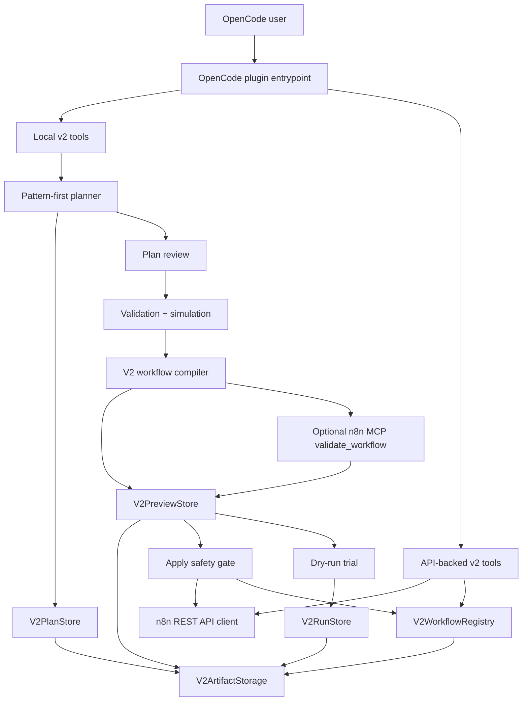

# opencode-n8n-builder

[](package.json)
[](package.json)
[](LICENSE)
[](https://opencode.ai/)
[](https://n8n.io/)

`opencode-n8n-builder` 是一个 OpenCode 插件，用于把自然语言自动化需求转化为可审查、可验证、可模拟、可预览并可安全写入 n8n 的 workflow。

当前版本：`2.0.0`

v2.0 使用 pattern-first planning：插件不会直接把一句需求粗暴转换成 n8n JSON，而是先生成业务 plan，再进行 review、validate、simulate、compile preview，最后只有在显式确认后才写入 n8n。

## 目录

- [适用场景](#适用场景)
- [核心能力](#核心能力)
- [快速开始](#快速开始)
- [工作流路径](#工作流路径)
- [公开工具](#公开工具)
- [技术架构](#技术架构)
- [v2 Plan 模型](#v2-plan-模型)
- [Artifact 与 Registry](#artifact-与-registry)
- [安全模型](#安全模型)
- [配置](#配置)
- [TypeScript API](#typescript-api)
- [兼容性与边界](#兼容性与边界)
- [本地验证](#本地验证)
- [文档索引](#文档索引)

## 适用场景

这个项目面向需要在 OpenCode 中设计和维护 n8n 自动化流程的团队或个人，尤其适合以下场景：

- 用自然语言快速生成 n8n workflow 草案，但需要在写入前看到计划、风险、模拟结果和映射关系。
- 把复杂自动化拆成 trigger、transform、branch、loop、external call、error handling 和 output 等可审查 pattern。
- 对现有 n8n workflow 做显式 claim/import，然后反向生成业务 plan，继续通过 v2 工具迭代。
- 在不触发真实 workflow、不调用外部 API 的前提下，进行 dry-run trial 和 field-flow 检查。
- 需要保留本地审计 artifact，例如 plan version、compiled preview、run artifact 和 workflow registry。
- 希望 n8n 写操作保持 conservative：默认 inactive、显式确认、active workflow 只读、防 stale update。

## 核心能力

- **Pattern-first planning**：把需求拆成业务 intent、inputs、entities、steps、patterns、branches、loops、external calls、error policy、outputs、test contract 和 credentials。
- **双路径体验**：`n8n_v2_auto_preview` 提供一站式 preview；高级用户可以逐步运行 create、review、patch、validate/simulate、compile 和 apply。
- **结构化 plan review**：解释每个 pattern 的选择原因、假设、风险、credential gap 和 simulation coverage。
- **Validation 与 simulation**：检查必需结构、branch default、loop bounds、external response contract、credential requirement，并生成 sample path 和 field traces。
- **Compiled preview**：把 plan 编译成 inactive n8n workflow preview，保存本地 artifact，不直接写 n8n。
- **Mapping trace**：将 business intent、plan step、pattern、n8n node、node parameter paths、expressions、source fields 和 output fields 关联起来。
- **可选 MCP validation**：配置 n8n MCP 后，compile preview 保存前会调用 `validate_workflow`；失败会阻止保存。
- **安全 apply**：只有 `confirm: true` 才能写入 n8n；创建默认 inactive workflow；更新仅限 v2-claimed inactive workflow。
- **Claim 与 reverse planning**：inactive workflow 可以 full claim；active workflow 只能 read-only claim；已 claim workflow 可反向生成 v2 plan。
- **Dry-run trial**：`n8n_v2_run_trial` 只重跑本地 validation/simulation，不触发 n8n，不调用外部 API。
- **隔离 artifact storage**：v2 数据写入 `.opencode/n8n-v2/`，并通过 `V2ArtifactStorage` adapter 抽象持久化层。

## 快速开始

### 1. 前置条件

- Node.js 20 或更新版本。
- OpenCode，并启用插件配置能力。
- 可选但推荐：一个可访问的 n8n 实例和 n8n public API key。
- 可选：n8n MCP endpoint，用于 compile preview 后的 `validate_workflow`。
- 可选：Docker Desktop，仅在运行真实 n8n E2E 测试时需要。

### 2. 安装

如果该包已发布到 npm，可以从 npm 包安装：

```bash
npm install opencode-n8n-builder
```

如果从本仓库本地运行：

```bash
npm install
npm run build
```

### 3. OpenCode 配置

在 OpenCode config 中启用插件。只做本地 plan、review、simulate、compile preview 时，可以不配置 n8n API key；需要 `apply`、`claim_workflow` 或 `reverse_plan` 时，需要 REST API 配置。真实 key 推荐通过环境变量提供；示例中的 `${...}` 表示配置位置占位，是否展开取决于 OpenCode 配置层。

```json
{
  "$schema": "https://opencode.ai/config.json",
  "plugin": ["opencode-n8n-builder"],
  "n8n": {
    "baseUrl": "https://your-instance.app.n8n.cloud/api/v1",
    "apiKey": "${N8N_API_KEY}",
    "mcpUrl": "https://your-instance.app.n8n.cloud/mcp-server/http",
    "mcpToken": "${N8N_MCP_TOKEN}"
  }
}
```

环境变量形式：

```bash
export N8N_BASE_URL="https://your-instance.app.n8n.cloud/api/v1"
export N8N_API_KEY="your-public-api-key"
export N8N_MCP_URL="https://your-instance.app.n8n.cloud/mcp-server/http"
export N8N_MCP_TOKEN="optional-mcp-token"
```

更多配置示例见 `examples/`：

- `examples/opencode.local-n8n.json`
- `examples/opencode.n8n-cloud.json`
- `examples/opencode.mcp-token.json`
- `examples/opencode.credentials.json`

### 4. 最小使用路径

先生成一个本地 preview，不写 n8n：

```text
Use n8n_v2_auto_preview to create a webhook workflow that receives an order,
maps the fields, branches by status, calls a fulfillment API, retries failures,
sends a notification, and responds to the webhook.
```

确认 preview 后再显式 apply：

```text
Use n8n_v2_apply with previewId "<preview-id>" and confirm true.
```

## 工作流路径

### Convenience Track

适合快速得到可审查 preview：

```text
n8n_v2_auto_preview
  -> create plan
  -> review plan
  -> validate/simulate
  -> compile preview
  -> stop before n8n writes
```

这个路径只写本地 v2 plan 和 preview artifact，不写 n8n。

### Advanced Track

适合复杂迭代、审计和调试：

```text
n8n_v2_create_plan
  -> n8n_v2_review_plan
  -> n8n_v2_patch_plan
  -> n8n_v2_validate_simulate
  -> n8n_v2_compile_preview
  -> n8n_v2_apply
```

每次 patch 都会生成新的 immutable plan version；compile 和 apply 都引用精确的 `planId` 与 `planVersion`。

### Existing Workflow Track

适合把已有 n8n workflow 纳入 v2 管理：

```text
n8n_v2_claim_workflow
  -> n8n_v2_reverse_plan
  -> review / patch / validate / compile
  -> n8n_v2_apply
```

inactive workflow 可以 full claim；active workflow 只能 read-only claim 和 reverse plan。active workflow structural apply 不属于 v2.0 能力。

## 公开工具

默认插件入口只暴露 `n8n_v2_*` 工具。v2 是 Breaking Reset：v1 build/update/inspect/readiness/list 工具不再通过默认入口注册，v1 artifact 也不会被静默迁移为 v2 ownership。

| Tool | 用途 | 写操作 | 需要 n8n API |
| --- | --- | --- | --- |
| `n8n_v2_auto_preview` | 从自然语言生成 plan、review、simulation 和 compiled preview | 写本地 plan/previews | 否 |
| `n8n_v2_create_plan` | 创建 v2 business workflow plan | 写本地 plans | 否 |
| `n8n_v2_review_plan` | 审查指定 plan version | 无 | 否 |
| `n8n_v2_patch_plan` | 基于已有 plan 保存新版本 | 写本地 plans | 否 |
| `n8n_v2_validate_simulate` | 运行结构验证和 sample simulation | 无 | 否 |
| `n8n_v2_compile_preview` | 编译 inactive workflow preview，可选生成 update diff | 写本地 previews | 仅 `workflowId` update preview 需要 |
| `n8n_v2_apply` | 创建 inactive workflow，或更新 v2-claimed inactive workflow | 写 n8n 和 v2 registry | 是 |
| `n8n_v2_claim_workflow` | 显式 claim/import 现有 workflow | preview 无写入；apply 写 registry，inactive full claim 可写 marker | 是 |
| `n8n_v2_reverse_plan` | 从 v2-claimed workflow 反向生成 plan | 写本地 plans 和 registry metadata | 是 |
| `n8n_v2_run_trial` | confirm-gated dry-run trial | 写本地 runs | 否 |

## 技术架构



主要模块：

| 模块 | 职责 |
| --- | --- |
| `src/plugin.ts` | OpenCode 插件入口，注册 v2 工具，按 local/API/MCP 场景装配依赖 |
| `src/config.ts` | 读取 OpenCode config 和环境变量，解析 v2 artifact paths、API 和 MCP 配置 |
| `src/v2/pattern-planner.ts` | 从自然语言生成 pattern-first business workflow plan |
| `src/v2/pattern-catalog.ts` | 定义七类基础 pattern family 及 medium-depth variants |
| `src/v2/plan-service.ts` | plan review、patch、validation 和 simulation |
| `src/v2/workflow-compiler.ts` | 将 v2 plan 编译为 inactive n8n workflow preview，并生成 mapping trace |
| `src/v2/preview-store.ts` | 保存 compiled preview、workflow hash、update target 和 MCP validation 状态 |
| `src/v2/registry.ts` | 维护 v2 workflow ownership registry |
| `src/v2/run-store.ts` | 保存 dry-run trial artifact |
| `src/v2/storage.ts` | `V2ArtifactStorage` adapter 和默认 `V2FileArtifactStorage` |
| `src/n8n-api-client.ts` | n8n REST API client |
| `src/n8n-mcp-client.ts` | n8n MCP JSON-RPC client |
| `src/security.ts` | secret redaction、私网 URL warning 和安全辅助逻辑 |

## v2 Plan 模型

v2 plan 是业务 workflow 模型，不是 n8n node graph。它用于让自动化设计先具备可解释性，再进入编译步骤。

核心结构：

- `intent`：业务目标、范围和非目标。
- `inputs`：trigger mode、输入 schema 和 sample input。
- `entities`：业务对象和字段定义。
- `steps`：业务步骤，每个步骤引用一个或多个 pattern。
- `patterns`：七类 pattern family 的实例、variant、confidence、risk 和 warnings。
- `branches`：条件路径、默认路径和目标步骤。
- `loops`：pagination、batch、per-item iteration 和边界。
- `externalCalls`：服务调用、请求 contract、响应 contract 和 credential requirement。
- `errorPolicy`：fail fast、retry、fallback、dead letter 和 notification。
- `outputs`：webhook response、service write 或 notification contract。
- `testContract`：示例输入、预期输出和 edge cases。
- `credentialRequirements`：credential 类型、auth mode、setup status 和是否阻断 apply。
- `trace`：prompt 到 plan 的关键决策摘要。

支持的七类基础 pattern：

| Pattern family | 常见 variants | 验证重点 |
| --- | --- | --- |
| `trigger` | webhook、schedule、manual、polling | input contract、trigger mode、polling cadence |
| `transform` | field mapping、format conversion、filtering、aggregation | 字段可用性、输出类型、表达式引用 |
| `branch` | if、switch、multi-condition、default branch | 条件字段、默认路径、样例覆盖 |
| `loop_batch` | pagination、batch、per-item、rate limit boundary | 终止条件、批量大小、迭代边界 |
| `error_handling` | retry、fallback、failure notification、dead letter | 最大重试次数、fallback path、错误不静默丢弃 |
| `external_call` | HTTP/API call、auth、response parsing、mock/schema | 请求 contract、credential、响应 contract |
| `output` | respond to webhook、write service、send notification | 输出 contract、side effect、生产影响 |

## Artifact 与 Registry

v2 artifacts 全部隔离在 `.opencode/n8n-v2/`：

```text
.opencode/n8n-v2/
  plans/
    <planId>/v1.json
    <planId>/v2.json
  previews/
    <previewId>.json
  registry/
    workflows.json
  runs/
    <runId>.json
  claims/
  exports/
```

重要规则：

- v2 不读取 v1 `.opencode/n8n-workflows.json` 作为 v2 registry。
- v2 不读取 v1 `.opencode/n8n-update-previews/` 作为 v2 preview。
- v2 ownership marker 是 `opencode-n8n-builder-v2`。
- plan version 是 immutable；patch 和 reverse planning 会产生新版本。
- preview 是 immutable；apply 引用精确 `previewId`。
- registry 记录 workflow ID、base URL、claim mode、active-at-claim、latest workflow hash、latest plan/preview metadata 和更新时间。
- v2 storage 通过 `V2ArtifactStorage` adapter 访问持久化层，默认实现是 `V2FileArtifactStorage`。

## 安全模型

本项目的默认策略是先审查、后写入，并尽量让写操作显式、可追踪、可阻断。

- **No silent n8n writes**：只有 `n8n_v2_apply` 和 `n8n_v2_claim_workflow` apply 模式会写 n8n，且需要 `confirm: true`。
- **Inactive by default**：新建 workflow 默认 `active: false`。
- **No active structural apply**：active workflow 可以 read-only claim 和 reverse plan，但不能被 v2.0 结构性更新。
- **Stale hash protection**：更新 v2-claimed inactive workflow 前会重新读取当前 workflow，并要求 hash 匹配 registry。
- **Base URL boundary**：registry 中的 n8n base URL 必须和当前配置匹配。
- **Read-only claim boundary**：read-only claimed workflow 不能被 update apply。
- **Credential gate**：阻断 apply 的 credential requirement 必须先解决。
- **Secret redaction**：错误、artifact 和普通工具输出会尽量避免明文 secret。
- **No execution trigger by default**：dry-run trial 不触发 n8n，不创建临时 workflow，不调用外部 API。
- **Breaking Reset**：v1 artifacts 不会被静默迁移，旧 workflow 必须显式 `n8n_v2_claim_workflow`。

## 配置

v2 工具按配置需求分三类：

| 场景 | 工具 | 必需配置 |
| --- | --- | --- |
| Local-only | `auto_preview`、`create_plan`、`review_plan`、`patch_plan`、`validate_simulate`、不带 `workflowId` 的 `compile_preview`、`run_trial` | 无 n8n API 要求 |
| API-backed | `apply`、`claim_workflow`、`reverse_plan`、带 `workflowId` 的 update preview | `N8N_BASE_URL` 和 `N8N_API_KEY` |
| Optional MCP validation | `auto_preview`、`compile_preview` | `N8N_MCP_URL`，可选 `N8N_MCP_TOKEN` |

MCP validation 状态：

- `not_configured`：没有配置 MCP endpoint。
- `passed`：MCP `validate_workflow` 通过。
- `warning`：MCP 返回 warning，warning 会进入 result 和 preview artifact。

MCP validation failure 会抛出 typed error，并阻止 preview 保存。

Credential mapping 示例：

```json
{
  "n8n": {
    "credentialEnv": {
      "httpHeaderAuth": {
        "name": "Fulfillment API",
        "type": "httpHeaderAuth",
        "authMode": "api_key",
        "env": {
          "name": "FULFILLMENT_HEADER_NAME",
          "value": "FULFILLMENT_API_KEY"
        }
      }
    }
  }
}
```

OAuth credential 建议使用 `authMode: "oauth2"`，插件会返回 handoff 信息，由用户在 n8n UI 完成授权。

## TypeScript API

包入口导出插件实例、工厂函数、错误类型、v2 tool args/results、artifact 类型、pattern catalog 和 n8n workflow 类型。

```ts
import {
  N8nBuilderPlugin,
  createN8nBuilderPlugin,
  N8nBuilderError,
  V2_PATTERN_CATALOG,
  type V2AutoPreviewArgs,
  type V2AutoPreviewResult,
  type V2CompiledPreview,
  type V2ArtifactStorage,
} from "opencode-n8n-builder"
```

常见扩展点：

- 使用 `createN8nBuilderPlugin({ version })` 在测试或封装中传入自定义版本号。
- 使用导出的 public contract 类型为外部 wrapper、测试夹具或文档生成器提供类型约束。
- 使用 `V2ArtifactStorage` 为未来 shared storage、database backend 或测试环境注入自定义持久化实现。

## 兼容性与边界

运行时要求：

- Node.js `>=20`
- OpenCode 插件运行环境
- n8n REST API，用于 apply、claim 和 reverse plan
- 可选 n8n MCP endpoint，用于 preview 保存前 validation

v2.0 的兼容性声明以 pattern family 为中心，而不是承诺覆盖每一个官方或社区节点的所有参数组合。七类基础 pattern 均有 medium-depth 支持；复杂或高风险变体会通过 warnings、较低 confidence 或人工 review 体现。

当前不作为 v2.0 承诺的能力：

- 修改 active workflow 的结构。
- 自动激活 workflow 或自动触发 workflow 执行。
- 全自动 OAuth consent。
- 完整 credential setup wizard。
- 可视化 canvas diff。
- exhaustive community node support。
- 完整 n8n node execution simulator。
- 自动采样 execution history。
- 团队共享 artifact backend。

更多细节见 `docs/compatibility.md` 和 `docs/pattern-compatibility-matrix.md`。

## 本地验证

默认验证不启动 Docker，也不需要真实 n8n：

```bash
npm run typecheck
npm run test
npm run build
npm run package:check
```

如果当前 shell 没有 `npm`，但依赖已安装，可以直接运行本地二进制：

```bash
./node_modules/.bin/tsc --noEmit
./node_modules/.bin/vitest run
./node_modules/.bin/tsup
node scripts/check-package-files.mjs
```

真实 n8n E2E 是显式 opt-in：

```bash
N8N_E2E_API_KEY=<your-test-key> npm run test:e2e
```

E2E 会使用 Docker 启动测试 n8n，并覆盖 v2 complex auto preview、dry-run trial 和 inactive apply path。

## 文档索引

- [安装指南](docs/installation.md)
- [配置指南](docs/configuration.md)
- [Credential Setup](docs/credential-setup.md)
- [Operations Guide](docs/operations.md)
- [Troubleshooting](docs/troubleshooting.md)
- [Release Checklist](docs/release-checklist.md)
- [Public Contract](docs/public-contract.md)
- [Compatibility](docs/compatibility.md)
- [Security Review](docs/security-review.md)
- [v1 to v2 Migration Guide](docs/migration-v1-to-v2.md)
- [Pattern Compatibility Matrix](docs/pattern-compatibility-matrix.md)
- [CHANGELOG](CHANGELOG.md)

## License

Apache-2.0. See [LICENSE](LICENSE).
