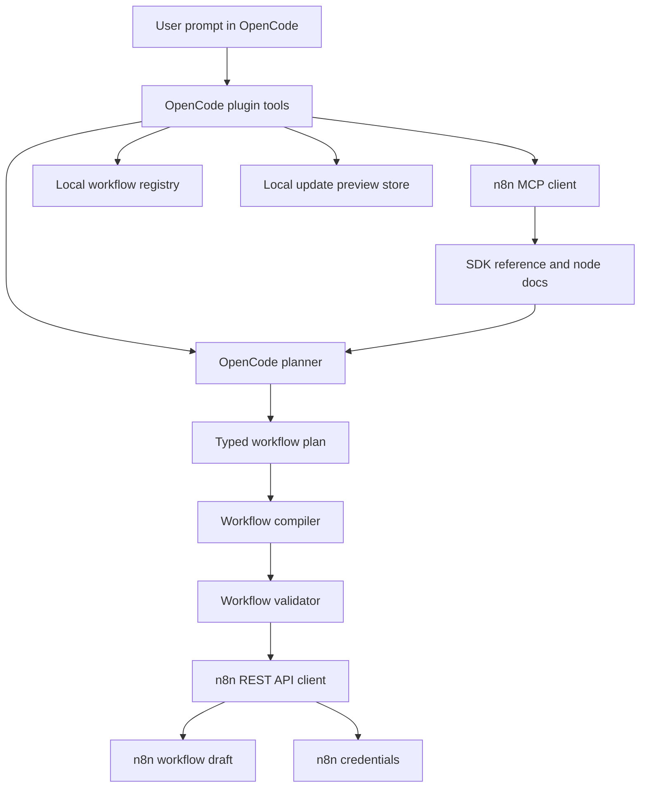

# opencode-n8n-builder

OpenCode plugin for creating, inspecting, and safely updating managed n8n workflow drafts from natural-language requests.

Current version: `0.1.0`

Development status: early v0.1 release. The core managed-workflow lifecycle is implemented and tested, with a deliberately conservative safety boundary.

## What This Project Does

`opencode-n8n-builder` connects OpenCode with n8n so a user can describe an automation workflow in natural language and let OpenCode help build the n8n workflow structure.

The plugin uses:

- OpenCode tool APIs for user-facing workflow commands.
- n8n official MCP endpoints for SDK guidance, node search, and node type documentation.
- n8n REST API endpoints for workflow and credential persistence.
- A local OpenCode workspace registry to track which workflows are managed by this plugin.

The first release focuses on safe draft creation and controlled iteration. It creates inactive n8n workflows, previews updates before applying them, and refuses to inspect or update arbitrary workflows that were not created and tracked by this plugin.

## Why It Exists

n8n has a large and evolving node ecosystem. Hardcoding node configuration knowledge into a plugin would become stale quickly. This project instead asks n8n MCP for current SDK guidance and node documentation, then uses OpenCode to generate a typed internal workflow plan, compile it to n8n workflow JSON, validate it, and persist it through the n8n API.

The intended workflow is:

1. The user describes an automation goal in OpenCode.
2. The plugin searches n8n node documentation dynamically.
3. OpenCode plans the workflow.
4. The plugin validates the generated workflow.
5. The plugin creates an inactive n8n draft.
6. The user tests or inspects it in n8n.
7. The user asks OpenCode for changes.
8. The plugin creates a preview, then applies it only after confirmation.

## Capabilities

### Implemented in v0.1.0

- Create inactive n8n workflow drafts from a natural-language prompt.
- Dynamically retrieve n8n SDK and node documentation through n8n MCP.
- Compile OpenCode workflow plans into n8n workflow JSON.
- Validate workflow structure before save or update.
- Track plugin-managed workflows in a local `.opencode/n8n-workflows.json` registry.
- Inspect only inactive workflows that are both visibly marked as plugin-managed and present in the local registry for the current n8n base URL.
- Update only inactive workflows that are both visibly marked as plugin-managed and present in the local registry for the current n8n base URL.
- Use a two-step update lifecycle: `preview` then `apply`.
- Reject stale update previews when the n8n workflow changed after preview generation.
- Resolve n8n credential references from configured local environment variables.
- Avoid writing plaintext secrets into workflow JSON, preview files, registry files, logs, or normal tool output.
- List locally managed workflows without requiring n8n API connectivity.

### Not Included Yet

- Updating arbitrary existing n8n workflows.
- Updating active workflows.
- Project or folder placement in n8n.
- Automatic OAuth consent flows.
- Full visual workflow diffing.
- Automatic workflow activation after creation or update.
- Guaranteed support for every possible third-party/community node.

## Architecture



Main modules:

- `src/plugin.ts`: OpenCode tool registration and dependency wiring.
- `src/opencode-planner.ts`: prompts OpenCode and parses structured workflow plans.
- `src/n8n-mcp-client.ts`: JSON-RPC MCP client for n8n documentation and node lookup.
- `src/n8n-api-client.ts`: REST client for n8n workflows and credentials.
- `src/workflow-compiler.ts`: compiles typed plans into n8n workflow JSON.
- `src/validator.ts`: validates workflow safety, markers, connections, active state, and secret-looking values.
- `src/credential-resolver.ts`: creates or reuses n8n credentials from configured environment variables.
- `src/registry.ts`: stores local ownership records for managed workflows.
- `src/preview-store.ts`: stores short-lived update previews.
- `src/tools/*`: tool-level orchestration for build, update, inspect, and list.

## OpenCode Tools

### `n8n_build_workflow`

Creates a new inactive n8n workflow draft managed by this plugin.

Arguments:

- `prompt` (required): natural-language workflow request.
- `name` (optional): workflow name override.

Behavior:

- Loads n8n SDK guidance and node documentation through MCP.
- Asks OpenCode to create a workflow plan.
- Compiles the plan to n8n workflow JSON.
- Forces `active: false`.
- Adds managed markers.
- Resolves configured credentials.
- Creates the workflow through n8n REST API.
- Writes a local registry record.

### `n8n_update_workflow`

Previews or applies an update to a managed workflow.

Arguments:

- `workflowId` (required): n8n workflow ID.
- `mode` (required): `preview` or `apply`.
- `prompt` (required in `preview` mode): requested workflow change.
- `previewId` (required in `apply` mode): preview ID returned by a previous preview.

Behavior:

- `preview` reads the current managed workflow, generates a replacement proposal, validates it, resolves credentials, and stores a short-lived preview.
- `apply` reloads the current workflow, verifies the base hash still matches the preview, revalidates the proposal, and updates n8n.
- Both modes require the workflow to be inactive, visibly marked as managed, and present in the local registry for the current n8n base URL.

### `n8n_inspect_workflow`

Inspects a managed workflow and returns a summary of nodes, credential types, connections, active state, and validation issues.

Arguments:

- `workflowId` (required): n8n workflow ID.

Behavior:

- Reads the workflow through n8n REST API.
- Blocks unmanaged workflows.
- Blocks active workflows in v0.1.
- Requires local registry ownership for the same configured n8n base URL.
- Returns details only after those checks pass.

### `n8n_list_managed_workflows`

Lists workflows tracked in the current OpenCode workspace registry.

Arguments: none.

Behavior:

- Reads `.opencode/n8n-workflows.json`.
- Does not require n8n API or MCP configuration.
- Returns workflow ID, name, URL, and last update timestamp.

## Safety Model

The v0.1 safety model is intentionally conservative.

The plugin will not update or inspect a workflow unless all of these are true:

- The n8n workflow contains the managed marker or tag for `opencode-n8n-builder`.
- The workflow is inactive.
- The local OpenCode workspace registry contains the workflow ID.
- The registry record belongs to the same configured `N8N_BASE_URL`.

Updates also require:

- A saved preview.
- Matching workflow ID.
- A non-expired preview.
- Matching proposed workflow hash.
- Matching current workflow hash against the preview base hash.

This prevents accidental edits to arbitrary n8n workflows and reduces the risk of overwriting direct changes made in the n8n UI after a preview was created.

## Secret Handling

Do not put API keys, OAuth secrets, passwords, bearer tokens, or webhook signing secrets in prompts or node parameters.

The plugin is designed to avoid secret leakage:

- The planner and validator reject common plaintext secret patterns.
- Credential resolution reads local environment variables.
- n8n workflow JSON stores credential references, not raw credential values.
- Registry files do not store secrets.
- Preview files do not store secrets.
- Normal tool output does not include secret values.
- n8n API and MCP errors are redacted before being surfaced.

OAuth authorization remains a manual n8n UI flow. The plugin can create or reference credentials where the n8n credential type supports API-created values, but it does not complete browser-based OAuth consent.

## Configuration

Add the plugin to your OpenCode config and provide n8n connection settings.

Example:

```json
{
  "$schema": "https://opencode.ai/config.json",
  "plugin": ["opencode-n8n-builder"],
  "n8n": {
    "baseUrl": "https://your-instance.app.n8n.cloud/api/v1",
    "mcpUrl": "https://your-instance.app.n8n.cloud/mcp",
    "credentialEnv": {
      "slackApi": {
        "name": "OpenCode Slack",
        "type": "slackApi",
        "env": {
          "accessToken": "SLACK_BOT_TOKEN"
        }
      }
    }
  }
}
```

Environment variables:

- `N8N_API_KEY`: n8n API key used for REST API calls.
- `N8N_BASE_URL`: n8n REST API base URL, for example `https://your-instance.app.n8n.cloud/api/v1`.
- `N8N_MCP_URL`: n8n MCP endpoint URL used when building workflows or previewing updates.

`N8N_BASE_URL` and `N8N_API_KEY` are required for workflow inspection, build, update preview, and update apply.

`N8N_MCP_URL` is required for build and update preview.

`n8n_list_managed_workflows` reads only the local workspace registry and does not require n8n connection settings.

`N8N_BASE_URL` and `N8N_MCP_URL` can be set either in the environment or in OpenCode config as `n8n.baseUrl` and `n8n.mcpUrl`.

`N8N_API_KEY` can also be provided as `n8n.apiKey`, but using the environment is preferred for local secret handling.

Optional config:

- `n8n.credentialEnv`: maps n8n credential types to credential names and local environment variable names.

## Credential Mapping

Credential mapping tells the plugin how to create or reuse n8n credential records without embedding secret values in workflow JSON.

Example:

```json
{
  "n8n": {
    "credentialEnv": {
      "slackApi": {
        "name": "OpenCode Slack",
        "type": "slackApi",
        "env": {
          "accessToken": "SLACK_BOT_TOKEN"
        }
      }
    }
  }
}
```

At runtime:

1. The workflow plan references a credential type, such as `slackApi`.
2. The resolver checks the configured credential mapping.
3. If a matching credential already exists in n8n, the workflow stores that credential reference.
4. If it does not exist and all required environment variables are available, the resolver creates the n8n credential.
5. If values are missing, the workflow can still be created as a draft and the tool result reports missing credentials.

## Local Development

Install dependencies:

```bash
npm install
```

Run checks:

```bash
npm run typecheck
npm run test
npm run build
```

If you need to run the local binaries directly, the equivalent commands are:

```bash
./node_modules/.bin/tsc --noEmit
./node_modules/.bin/vitest run
./node_modules/.bin/tsup
```

Package scripts:

- `npm run typecheck`: TypeScript type checking.
- `npm run test`: Vitest test suite.
- `npm run build`: Build package output with tsup.
- `npm run check`: Typecheck, test, and build.

## Test Coverage

The v0.1.0 test suite covers:

- OpenCode plugin registration and tool wiring.
- Configuration loading from env and OpenCode config.
- n8n MCP JSON-RPC envelopes, content parsing, and error redaction.
- n8n REST API workflow and credential calls.
- Planner JSON extraction and validation.
- Workflow compiler behavior.
- Workflow validation, secret detection, connection validation, and managed markers.
- Credential resolver behavior.
- Registry and preview store persistence.
- Build workflow orchestration.
- Update preview/apply safety gates.
- Inspect/list safety gates.

Latest local verification for v0.1.0:

- TypeScript: passed.
- Vitest: 12 test files, 112 tests passed.
- tsup build: passed.

## Repository State

Version `0.1.0` represents the first functional development milestone:

- Core plugin runtime is wired.
- Managed workflow build/update/inspect/list tools are implemented.
- Conservative workflow ownership and active-workflow safety checks are in place.
- Secret handling and credential reference behavior are implemented.
- Public README describes the current supported scope.

## Roadmap

Potential next milestones:

- Broader real-world n8n node compatibility testing.
- Better workflow diff output for update previews.
- Optional user-approved active workflow handling.
- n8n project/folder placement once API support is fully defined.
- More granular credential provider support.
- Import or claim flow for existing workflows, with explicit user confirmation.
- Integration tests against a disposable n8n instance.
- Release packaging and installation documentation for OpenCode plugin distribution.

## License

Apache-2.0, matching the repository `LICENSE` file and `package.json`.
