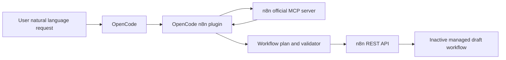

# OpenCode n8n Builder Plugin Design

Date: 2026-06-04

## Summary

Build an OpenCode plugin that connects OpenCode to n8n so users can describe an automation in natural language and have OpenCode create or update an n8n workflow draft.

The v1 product supports a managed workflow lifecycle:

- Create a new inactive n8n draft workflow from a user prompt.
- Update only workflows previously created and marked as managed by this plugin.
- Use the official n8n MCP server for dynamic node discovery, SDK guidance, and node type/schema lookup.
- Use the n8n public REST API for workflow and credential persistence.
- Keep secrets out of generated workflow JSON, local registry files, logs, and OpenCode-visible output.

## Non-Goals

The first version will not:

- Modify arbitrary existing n8n workflows.
- Activate workflows automatically.
- Execute workflows automatically.
- Guarantee perfect first-pass configuration for every official n8n node.
- Store third-party API keys, tokens, passwords, or OAuth secrets in workflow JSON.
- Fully automate OAuth authorization flows.

## User Experience

Typical create flow:

1. User asks OpenCode to build a workflow, for example: "Create an n8n workflow that receives order webhooks, writes the order to Google Sheets, and sends Slack alerts for high-value orders."
2. OpenCode calls the plugin's build tool.
3. The plugin queries n8n MCP for SDK guidance and relevant node schemas.
4. The plugin creates an inactive n8n draft workflow.
5. OpenCode returns the workflow URL, summary, missing credentials, and any warnings.

Typical update flow:

1. User tests the workflow in n8n and asks for a change, for example: "Add a condition so Slack only receives orders over 5000."
2. OpenCode calls the plugin's update tool in preview mode.
3. The plugin checks that the workflow is managed by this plugin.
4. The plugin reads the current workflow, generates a change plan, validates the proposed result, and returns a preview summary.
5. OpenCode shows the summary to the user.
6. After user approval, OpenCode calls the update tool in apply mode with the preview ID.
7. The plugin revalidates that the current workflow still matches the preview base hash, then updates the managed draft.
8. OpenCode returns a concise applied change summary and the workflow URL.

## Architecture

The plugin is published as an npm package and loaded through OpenCode's plugin configuration. It exposes OpenCode custom tools and uses n8n MCP plus n8n REST API behind those tools.



### Modules

`config`

Reads plugin configuration from OpenCode config and environment variables:

- `N8N_BASE_URL`
- `N8N_API_KEY`
- n8n MCP endpoint and auth settings
- credential environment mapping
- optional project or folder defaults

`mcpClient`

Calls official n8n MCP workflow builder tools, including:

- SDK reference retrieval
- node search
- node type/schema retrieval
- future validation or workflow builder tools if they are stable and useful

`workflowPlanner`

Turns the user prompt and MCP context into an intermediate `WorkflowPlan`. This plan describes business flow, nodes, operations, credentials, branches, and data mapping intent without being raw n8n JSON.

`workflowCompiler`

Compiles `WorkflowPlan` into n8n workflow JSON:

- nodes
- connections
- settings
- static data where needed
- tags, description, and management marker metadata
- credential references

`credentialResolver`

Matches or creates credentials in n8n from configured environment variables. It never writes secret values into workflow JSON, the local registry, logs, or normal user output.

`workflowRegistry`

Stores local ownership and state in `.opencode/n8n-workflows.json`. The registry includes:

- n8n base URL
- workflow ID
- workflow name
- managed marker
- plugin version
- OpenCode workspace identity if available
- last plan hash
- latest update timestamp

`previewStore`

Stores pending update previews without secrets. Previews live in `.opencode/n8n-update-previews/` or an equivalent plugin-managed cache, expire after 30 minutes by default, and include:

- preview ID
- workflow ID
- base workflow hash
- proposed workflow hash
- change summary
- compiled proposed workflow JSON with no plaintext secrets

`n8nApiClient`

Calls n8n REST API endpoints for workflow and credential operations using `X-N8N-API-KEY`.

`validator`

Performs local checks before create or update:

- unique node names
- connection targets exist
- required parameters are present where known
- credential references are not missing silently
- no plaintext secrets in node parameters
- no update of unmanaged workflows
- active workflow update policy is enforced

## OpenCode Tool Interface

### `n8n_build_workflow`

Creates a new managed inactive workflow draft.

```ts
type N8nBuildWorkflowArgs = {
  prompt: string
  name?: string
  projectId?: string
  folderId?: string
}
```

Result:

```ts
type N8nBuildWorkflowResult = {
  workflowId: string
  name: string
  url: string
  nodeCount: number
  summary: string
  missingCredentials: CredentialGap[]
  warnings: Warning[]
}
```

### `n8n_update_workflow`

Previews or applies an update to a workflow managed by this plugin.

```ts
type N8nUpdateWorkflowArgs = {
  workflowId: string
  prompt?: string
  mode: "preview" | "apply"
  previewId?: string
}
```

The tool must verify ownership before doing any update work. In `preview` mode, it reads the current workflow, generates a patch plan, compiles and validates the proposed full workflow JSON, stores a short-lived preview, and returns a change summary. It must not call the n8n update API in preview mode.

In `apply` mode, the tool requires `previewId`. It reloads the current workflow, verifies that the workflow still matches the preview's base hash, reruns validation, then calls the n8n update API. This prevents applying a stale preview after the workflow changed in n8n UI or another OpenCode session.

Result:

```ts
type N8nUpdateWorkflowResult = {
  workflowId: string
  name: string
  url: string
  mode: "preview" | "apply"
  previewId?: string
  summary: string
  changes: string[]
  missingCredentials: CredentialGap[]
  warnings: Warning[]
}
```

### `n8n_inspect_workflow`

Reads and summarizes a managed workflow's structure and likely issues.

```ts
type N8nInspectWorkflowArgs = {
  workflowId: string
}
```

Result:

```ts
type N8nInspectWorkflowResult = {
  workflowId: string
  name: string
  active: boolean
  nodes: WorkflowNodeSummary[]
  connections: WorkflowConnectionSummary[]
  issues: WorkflowIssue[]
}
```

### `n8n_list_managed_workflows`

Lists workflows managed from the current OpenCode workspace.

```ts
type N8nListManagedWorkflowsArgs = {}
```

Result:

```ts
type N8nListManagedWorkflowsResult = {
  workflows: Array<{
    workflowId: string
    name: string
    url: string
    active?: boolean
    lastUpdatedAt?: string
  }>
}
```

## Data Flow

### Create

1. Read plugin config and environment.
2. Call n8n MCP SDK reference before building the workflow.
3. Search official n8n nodes based on the user prompt.
4. Retrieve specific node type/schema details for selected candidates.
5. Generate `WorkflowPlan`.
6. Compile `WorkflowPlan` into n8n workflow JSON.
7. Resolve credentials by matching existing credentials or creating supported credential types from environment variables.
8. Validate the workflow JSON and security constraints.
9. Create an inactive workflow using n8n REST API.
10. Write the local registry entry.
11. Return URL, summary, missing credentials, and warnings.

### Update

1. Resolve the target workflow from registry or user-supplied ID.
2. Verify that the target has the OpenCode plugin management marker.
3. Read the current workflow through n8n REST API.
4. Retrieve MCP context for newly needed or changed nodes.
5. Generate `WorkflowPatchPlan`.
6. Compile to a complete replacement workflow JSON.
7. Validate structure, security constraints, and active workflow policy.
8. In preview mode, store a short-lived preview with base workflow hash and return URL, change summary, missing credentials, and warnings without calling update.
9. In apply mode, require `previewId`, reload the workflow, compare the current hash with the preview base hash, and rerun validation.
10. Update the workflow through n8n REST API.
11. Update local registry hash, timestamp, and latest summary.
12. Return URL, applied change summary, missing credentials, and warnings.

## Managed Workflow Marker

The plugin must mark created workflows so ownership can be verified later. The marker should be present both locally and in n8n-visible metadata where supported.

Recommended marker fields:

```json
{
  "managedBy": "opencode-n8n-builder",
  "managedByVersion": "0.1.0",
  "createdAt": "2026-06-04T00:00:00.000Z",
  "workspaceId": "ocn8n-local-workspace"
}
```

If no stable workspace ID is available, omit `workspaceId` and rely on the registry plus n8n-visible tags/description marker.

If n8n metadata support is limited, use a combination of description, tags, and registry verification. Registry-only ownership is not enough for destructive updates because a copied registry file could point at a workflow that was not created by this plugin.

## Credential Strategy

Principle: OpenCode may read environment variables, but generated workflow JSON must never contain plaintext secrets.

Example configuration:

```json
{
  "$schema": "https://opencode.ai/config.json",
  "plugin": ["opencode-n8n-builder"],
  "n8n": {
    "baseUrl": "https://your-instance.app.n8n.cloud/api/v1",
    "mcpUrl": "https://your-instance.app.n8n.cloud/mcp",
    "credentialEnv": {
      "slackApi": {
        "name": "OpenCode Slack",
        "type": "slackApi",
        "env": {
          "accessToken": "SLACK_BOT_TOKEN"
        }
      },
      "googleSheetsOAuth2Api": {
        "name": "OpenCode Google Sheets",
        "type": "googleSheetsOAuth2Api",
        "env": {
          "clientId": "GOOGLE_CLIENT_ID",
          "clientSecret": "GOOGLE_CLIENT_SECRET"
        }
      }
    }
  }
}
```

Runtime behavior:

1. If a selected node requires credentials, look for an existing credential by configured name/type.
2. If found, reference it in the workflow.
3. If not found, check `credentialEnv`.
4. If the environment variables are complete and the credential type is supported, create the n8n credential through API.
5. If credentials cannot be created, still create the draft workflow where possible and return a missing credential report.

OAuth caveat:

OAuth credentials often require an interactive authorization callback and should not be treated as simple secret material. v1 should prefer existing OAuth credentials and instruct the user to authorize them in n8n UI when absent.

## Active Workflow Policy

v1 should default to safe behavior:

- Creating workflows always creates inactive drafts.
- Updating inactive managed workflows is allowed.
- Updating active managed workflows is blocked by default.
- A later version may support copying an active workflow to a new draft before updating, or explicit confirmation for active updates.

## Error Handling

Configuration errors:

- Missing `N8N_BASE_URL`, `N8N_API_KEY`, or MCP connection details stops the operation.

MCP failures:

- If MCP is unavailable, stop with setup guidance.
- If a node cannot be found, do not invent a node type. Return alternatives such as `HTTP Request` or ask for clarification.

Schema gaps:

- Required unknowns should trigger a clarifying question where possible.
- Safe defaults may be used for non-critical fields and reported in the summary.

Credential gaps:

- Draft creation may continue if the missing credential can be repaired in n8n UI.
- Missing credentials must be reported explicitly.

Validation failures:

- Do not call n8n API if local validation fails.
- Return concrete errors such as duplicate node names, missing connection targets, or plaintext secret detection.

Update conflicts:

- Stop if the workflow is not in registry, lacks the managed marker, or appears to have diverged significantly.
- Ask the user to inspect or re-sync before updating.
- Stop if an apply request uses a missing, expired, or stale preview ID.

High-risk nodes:

- Warn or require future confirmation for nodes such as Execute Command, Code with external modules, HTTP Request to private network ranges, and workflow patterns that may exfiltrate data.

## Testing Plan

Unit tests:

- Compile `WorkflowPlan` to n8n JSON.
- Generate node connections.
- Enforce unique node names.
- Resolve credential references.
- Detect plaintext secrets.
- Enforce ownership and active workflow policies.

Fixture tests:

- Use representative prompts with stable mocked MCP responses.
- Verify generated JSON shape and warnings.

Integration tests:

- Run against a local or self-hosted n8n test instance.
- Create an inactive managed workflow.
- Read and update that managed workflow.
- Verify registry entries.
- Verify n8n-visible marker presence.

Security tests:

- Confirm secret values do not appear in workflow JSON.
- Confirm secret values do not appear in registry.
- Confirm secret values do not appear in logs or returned tool output.

## Acceptance Criteria

- A user can describe a workflow in OpenCode and receive a link to an inactive n8n draft workflow.
- The plugin uses n8n MCP for node discovery and node schema lookup rather than hardcoding a fixed node list.
- The plugin can update a workflow it previously created and marked as managed, using preview then apply.
- The plugin refuses to update workflows that it does not manage.
- The plugin refuses to apply stale update previews.
- The plugin does not write plaintext secrets into workflow JSON, local registry, logs, or tool responses.
- Missing credentials are reported clearly and do not cause silent bad workflow creation.
- Failures return actionable messages instead of creating malformed workflows.

## References

- OpenCode Plugins: https://opencode.ai/docs/plugins/
- OpenCode Ecosystem: https://opencode.ai/docs/ecosystem
- n8n Public REST API: https://docs.n8n.io/api/
- n8n API Authentication: https://docs.n8n.io/api/authentication/
- n8n MCP tools reference: https://docs.n8n.io/advanced-ai/mcp/mcp_tools_reference/
