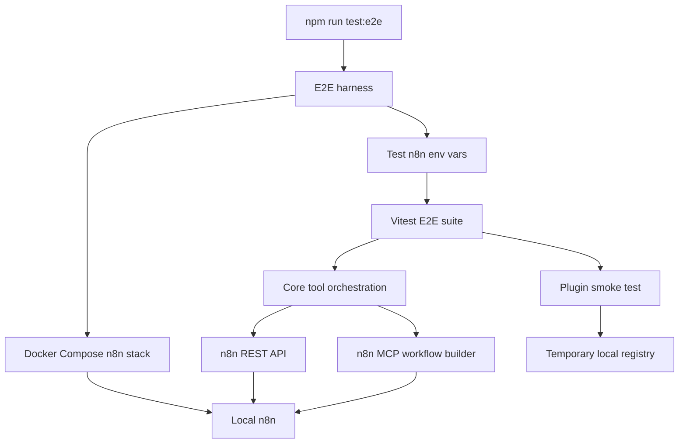

# v0.2 Docker n8n E2E Validation Design

Date: 2026-06-08

## Summary

v0.2 adds an opt-in real n8n validation layer for `opencode-n8n-builder`.

The goal is to prove that the v0.1 managed workflow lifecycle works against a real n8n instance, not only mocked clients and unit tests. The test environment uses local Docker n8n as the baseline. Default unit tests remain fast and do not require Docker. Real n8n verification runs only when explicitly requested with a new E2E command.

## Confirmed Decisions

- Use local Docker n8n as the primary v0.2 verification environment.
- Keep E2E tests opt-in. Default `npm test` must not start Docker.
- Add a dedicated command such as `npm run test:e2e`.
- Use two E2E layers:
  - Core module E2E for the main build/update/inspect/list lifecycle.
  - One lightweight plugin-level smoke test to verify OpenCode tool wiring.
- Use a minimum stable workflow set first:
  - Manual Trigger
  - Webhook
  - Schedule
  - Set
  - IF
  - HTTP Request
- Do not include Slack, Email, OAuth, or other credential-heavy nodes in the v0.2 baseline.

## Goals

1. Start a local n8n instance in Docker for test runs.
2. Wait until n8n is ready before running tests.
3. Run real API calls against the Docker n8n instance.
4. Run real MCP calls if the local n8n version exposes the official MCP workflow builder tools.
5. Exercise the plugin's core managed workflow lifecycle:
   - create inactive workflow
   - inspect managed workflow
   - preview update
   - apply update
   - list managed workflows
   - clean up created test workflows
6. Add diagnostics that explain missing Docker, unavailable n8n, bad API configuration, or unavailable MCP tools.
7. Preserve v0.1 safety boundaries:
   - no arbitrary workflow update
   - no active workflow update
   - no active workflow inspect
   - no plaintext secret persistence

## Non-Goals

v0.2 will not:

- Add support for modifying arbitrary existing workflows.
- Add active workflow update support.
- Add project or folder placement.
- Add OAuth automation.
- Add Slack, Email, or other credential-heavy E2E scenarios.
- Make E2E part of default `npm test`.
- Require Docker for ordinary local development.
- Publish a new npm package automatically.

## User Experience

### Ordinary Development

The existing development loop remains unchanged:

```bash
npm run test
npm run typecheck
npm run build
```

These commands do not require Docker.

### E2E Verification

A developer explicitly runs:

```bash
npm run test:e2e
```

The command:

1. Checks that Docker is available.
2. Starts a local n8n test stack.
3. Waits for n8n readiness.
4. Sets test-only n8n connection environment variables.
5. Runs E2E tests.
6. Cleans up workflows created by the test run.
7. Stops the test stack unless a debug flag asks to keep it running.

### Debug Mode

When an E2E test fails, developers need enough information to reproduce the issue. v0.2 should support a debug mode such as:

```bash
N8N_E2E_KEEP_ALIVE=1 npm run test:e2e
```

In debug mode, the Docker stack remains running after a failure and the output shows the local n8n URL.

## Architecture



### Docker n8n Stack

The E2E stack should be isolated from user data.

Expected properties:

- Uses a pinned n8n Docker image.
- Stores all data in a temporary Docker volume or project-scoped test volume.
- Exposes n8n on localhost with a deterministic port.
- Configures a deterministic test API key.
- Enables any n8n setting required for public API and official MCP access.
- Uses a test-only encryption key.

If MCP setup needs a version-specific flag or workflow-level bootstrap, the E2E harness should fail with a clear message that names the missing capability rather than continuing with misleading failures.

### E2E Harness

The harness owns:

- Docker availability checks.
- Docker Compose lifecycle.
- n8n readiness polling.
- test environment variable construction.
- cleanup after tests.
- clear failure messages.

The harness should be TypeScript or shell-light JavaScript, matching the repo's TypeScript tooling. It should avoid introducing a large new framework.

### Core Module E2E

The main E2E suite calls the existing core orchestration functions directly:

- `buildWorkflow`
- `updateWorkflow`
- `inspectWorkflow`
- `listManagedWorkflows`

This keeps failures easier to localize than a full OpenCode session simulation.

The planner dependency can be deterministic for v0.2. It should return known workflow plans for the minimum stable node set. The E2E purpose is to validate real n8n persistence and safety behavior, not LLM output quality.

### MCP E2E

The E2E suite should include direct checks that the MCP client can call the official workflow builder tools used by the plugin:

- `get_sdk_reference`
- `search_nodes`
- `get_node_types`

Where possible, it should also validate the exact tool argument shapes currently used by the plugin.

If local n8n MCP exposes `validate_workflow`, v0.2 can include a direct smoke check, but it should not redesign the workflow generation path yet. Deeper MCP validation belongs in a later milestone.

### Plugin-Level Smoke Test

The plugin-level smoke test verifies:

- `createN8nBuilderPlugin()` initializes.
- The four tools register:
  - `n8n_build_workflow`
  - `n8n_update_workflow`
  - `n8n_inspect_workflow`
  - `n8n_list_managed_workflows`
- At least one tool execute path works with real configuration and a temporary workspace.

The smoke test should stay small. Full behavior belongs in the core E2E suite.

## Test Scenarios

### Scenario 1: Build Managed Workflow

Use a deterministic workflow plan with low-risk nodes, such as Manual Trigger and Set.

Expected:

- n8n workflow is created.
- workflow is inactive.
- workflow has the managed marker/tag.
- registry record is written.
- result contains workflow ID, name, URL, node count, and summary.

### Scenario 2: Inspect Managed Workflow

Inspect the workflow created in Scenario 1.

Expected:

- inspect returns workflow ID and name.
- inspect returns node summaries and connections.
- inspect only succeeds because the workflow is inactive, marked, and locally registered for the same base URL.

### Scenario 3: Preview Update

Preview an update that adds a simple low-risk node or branch, such as IF or another Set node.

Expected:

- preview does not call n8n update.
- preview record is stored.
- result includes preview ID, summary, and changes.
- proposed workflow remains inactive and managed.

### Scenario 4: Apply Update

Apply the preview from Scenario 3.

Expected:

- current workflow still matches preview base hash.
- n8n workflow is updated.
- registry record is updated.
- workflow remains inactive and managed.

### Scenario 5: List Managed Workflows

List local registry entries.

Expected:

- created workflow appears in local list.
- list command does not require MCP.

### Scenario 6: Safety Negative Checks

Create or modify controlled test conditions for negative checks.

Expected:

- update blocks active workflow.
- inspect blocks active workflow.
- update blocks workflow missing registry ownership.
- inspect blocks workflow missing registry ownership.
- stale preview apply is rejected.

### Scenario 7: Cleanup

Delete workflows created by the E2E run or leave the test stack disposable.

Expected:

- default run leaves no durable user data.
- debug mode can intentionally keep the stack alive.

## Configuration

New environment variables should be test-scoped:

- `N8N_E2E_BASE_URL`
- `N8N_E2E_API_KEY`
- `N8N_E2E_MCP_URL`
- `N8N_E2E_KEEP_ALIVE`
- `N8N_E2E_DOCKER_COMPOSE_FILE`

The production plugin config remains unchanged. E2E code maps these variables into the existing plugin configuration shape during tests.

## Files and Responsibilities

Expected new files:

- `docker-compose.e2e.yml`
  - Defines the local n8n test stack.
- `tests/e2e/helpers/n8n-e2e-harness.ts`
  - Starts/stops Docker stack, polls readiness, builds test env.
- `tests/e2e/helpers/test-workflows.ts`
  - Provides deterministic workflow plans for low-risk nodes.
- `tests/e2e/n8n-mcp.e2e.test.ts`
  - Verifies MCP tool availability and argument compatibility.
- `tests/e2e/workflow-lifecycle.e2e.test.ts`
  - Verifies build/update/inspect/list lifecycle against real n8n.
- `tests/e2e/plugin-smoke.e2e.test.ts`
  - Verifies plugin registration and one real tool execution path.

Expected modified files:

- `package.json`
  - Adds `test:e2e`.
- `README.md`
  - Adds opt-in E2E instructions.
- `vitest.config.ts` or a new `vitest.e2e.config.ts`
  - Keeps unit tests and E2E tests separated.

## Error Handling

E2E startup should fail early with actionable messages:

- Docker CLI missing.
- Docker daemon not running.
- n8n container failed to start.
- n8n API not ready within timeout.
- API key rejected.
- MCP endpoint unavailable.
- required MCP tool missing.

Failures must not print API keys, credential values, or raw secret-bearing environment values.

## Test Data and Cleanup

All test workflows should use a unique name prefix, for example:

```text
opencode-n8n-builder-e2e-<timestamp>-<random>
```

Cleanup should delete all workflows created during the run when the n8n API supports deletion.

If deletion is unavailable or fails, the disposable Docker volume makes the default run safe. Debug mode is the only mode that should leave data behind intentionally.

## Success Criteria

v0.2 is complete when:

- `npm run test` still runs without Docker.
- `npm run test:e2e` starts local Docker n8n and runs real E2E tests.
- E2E validates create, inspect, preview, apply, list, and cleanup.
- E2E includes at least one plugin-level smoke test.
- E2E has clear failure messages for missing Docker, unavailable n8n, API auth failure, and MCP unavailability.
- README documents how to run and debug E2E.
- Existing unit tests still pass.
- TypeScript and build checks still pass.

## Risks

### n8n MCP Version Drift

n8n's official MCP workflow builder tooling is version-gated. The E2E stack must pin a known n8n version or fail with a clear version/capability message.

### Docker Runtime Differences

Docker Desktop, Colima, and Linux Docker setups can behave differently. The harness should use Docker CLI and Docker Compose in a conservative way and avoid platform-specific assumptions.

### API Key Bootstrap

If n8n Docker cannot be configured with a deterministic API key through environment variables, the E2E harness may need a bootstrap step. The implementation plan must verify the actual n8n mechanism before coding the final harness.

### Test Flakiness

n8n startup time and MCP availability may vary. Readiness checks should poll with a timeout and provide logs on failure.

## Future Milestones

v0.2 intentionally creates a stable verification baseline. Later milestones can build on it:

- v0.3: deeper MCP workflow validation and better node generation quality.
- v0.4: explicit claim/import flow for existing workflows.
- v0.5: richer workflow diff output for update previews.
- v0.6: credential and OAuth user experience improvements.
- v0.7: project/folder placement support.

## Spec Self-Review

- Placeholder scan: no TBD/TODO placeholders remain.
- Scope check: focused on Docker n8n E2E validation and stability only.
- Consistency check: E2E is opt-in throughout; default unit testing remains Docker-free.
- Safety check: v0.1 ownership and active workflow restrictions remain unchanged.
